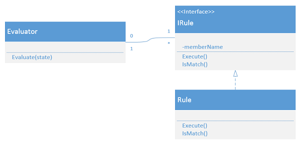

# Rules Design Pattern

## O que é? What is it?
O design pattern "Rules" vem para tentar simplificar códigos de grande complexidade
ciclomática, ou seja, muitos "if-else" statements.

The "Rules" design pattern tries to simplify codes with great cyclomatic complexity,
that is, many "if-else" statements.

## Passos - Step by step
### Primeiro Passo - First Step
O primeiro passo para melhoria desse tipo de código é aplicar predicados significativos.

The first step to improve this type of code is to apply meaningful predicates.

```csharp
// NaiveDiscountUseCase.cs

if (customer.DateOfBirth < DateTime.Now.AddYears(-65))
{
    // ...
}

// PredicatesDiscountUseCase.cs
// Refactor to
if (IsSenior(customer))
{
    // ...
}

// ...

private bool IsSenior(Customer customer)
{
    return customer.DateOfBirth < DateTime.Now.AddYears(-65);
}
```

Isso torna as condicionais um pouco mais fáceis de serem lidas e reutilizadas, mas
traz uma questão sobre testes: todos os métodos são privados e não podem ser
testados individualmente, apenas como parte dos casos de uso.

This makes conditionals a bit easier to read and be reutilized, but it also brings
a question about testing: all the methods are private and can't be tested individually,
only as part of the use cases.

### Segundo Passo - Second Step (PredicatesDiscountUseCase.cs)
Podemos melhorar ainda mais nosso código, criando métodos de extensão e/ou adicionando
comportamentos às nossas classes. Fazendo isso, podemos testar os métodos individualmente,
além de seguir o Princípio da Responsabilidade Única.

We can improve our code even more, by creating extension methods and/or adding
behaviors to our classes. By doing this, we can now test our methods individually,
and also adhere to the Single Responsibility Principle.

```csharp
// PredicatesDiscountUseCase.cs

if (IsSenior(customer))
{
    // ...
}

// Refactor to
// PredicateExtDiscountUseCase.cs
if (customer.IsSenior())
{
    // ...
}

// CustomerExtensions.cs
public static bool IsSenior(
    this Customer customer,
    DateTime? date = null
)
{
    return customer.DateOfBirth < date.ToValueOrDefault().AddYears(-65);
}
```

### Terceiro Passo - Third Step
Os dois primeiros passos ajudam na limpeza e reutilização do código, mas não
resolvem o problema dos "if-else" statements, que persistem no código e podem
aumentar, caso novas regras sejam adicionadas.

Para resolver esse problema, iremos aplicar, finalmente, o design pattern Rules.



Para aplicar o padrão, podemos criar uma interface para o conjunto de regras do
caso de uso (IDiscountRule.cs) e, para cada if/else em nosso código, vamos criar
uma classe, que irão implementar a interface criada.

Dessa maneira, teremos:
- IDiscountRule
    - BirthdayDiscountRule
    - LoyalCustomerDiscountRule
    - NewCustomerDiscountRule
    - SeniorDiscountRule
    - VeteranDiscountRule

Com as regras definidas, podemos criar uma lista do tipo "IRule" dentro dos casos
de uso e aplicar as regras iterando sobre esta lista:

```csharp
private readonly List<IRule> _rules = new();

public Evaluator()
{
    _rules.Add(new FirstRule());
    _rules.Add(new SecondRule());
    // ...
    _rules.Add(new NthRule());
}

public TResult Action(State state)
{
    // ..

    foreach (var rule in _rules)
    {
        // Apply the rule
        rule.Execute(state);
    }

    return result;
}
```

Dessa maneira, isolamos os comportamentos, conseguimos testá-los individualmente
e, o mais importante, no código fica extremamente simples de ser lido e entendido.

**Obs:** em uma situação real, as regras serão fornecidas dinamicamente por meio
de um container de IoC.

To apply the pattern, we can create an interface for the use case's set of rules
(IDiscountRule) and, for each if-else on the code, we are going to create a class,
which will implement the created interface.

Therefore, we'll have:
- IDiscountRule
    - BirthdayDiscountRule
    - LoyalCustomerDiscountRule
    - NewCustomerDiscountRule
    - SeniorDiscountRule
    - VeteranDiscountRule

With our defined rules, we can implement an "IRule" type list within our use cases
and apply each rule by iterating over this list.

```csharp
private readonly List<IRule> _rules = new();

public Evaluator()
{
    _rules.Add(new FirstRule());
    _rules.Add(new SecondRule());
    // ...
    _rules.Add(new NthRule());
}

public TResult Action(State state)
{
    // ..

    foreach (var rule in _rules)
    {
        // Apply the rule
        rule.Execute(state);
    }

    return result;
}
```

By doing this, we isolate behaviors, managed to test them individually and, most
important, our code becomes extremely simple to be read and understood.

**Obs:** in a real situation, the rules would be dynamically provided by an IoC
container.
